<div align="center">

<picture>
  <source media="(prefers-color-scheme: dark)" srcset="assets/rask-logo-dark.svg">
  
</picture>

### The .NET One Person Framework — build, run, and ship a whole product solo, in C#, on one server.

**[Site ↗](https://pal-tamas.github.io/rask/)** · **[Docs ↗](https://pal-tamas.github.io/rask/docs/)** · **[Playground ↗](https://pal-tamas.github.io/rask/playground/)**



</div>

You write components as plain C# classes that return a tree of HTML from `Render()`. State is a field, an
event handler is a delegate, and the component re-renders itself — no `.razor`, no JSX, no JavaScript,
nothing to write in another language:

```csharp
[Route("/counter")]
public sealed partial class Counter : Component
{
    private int _count;

    protected override Component? Render() =>
    [
        H1["Counter"],
        P[$"Current count: {_count}"],
        Button.OnClick(() => _count++)["Click me"]
    ];
}
```

**Rask is the .NET One Person Framework.** One developer builds, runs and ships a *complete* product —
the UI, the data, the auth, the background work and the deployment — from **one C# codebase on one
server**, with **SQLite as the production database**. No PaaS to rent, no stack of services to glue, no
second language to context-switch into. The same component runs three ways: server-rendered with live
updates over a WebSocket, fully client-side on WebAssembly as an installable offline PWA, or as a real
iOS/Android app.

## Quickstart

An empty folder to a live, HTTPS, database-backed product, by one person in one sitting:

```bash
dotnet tool install -g Rask.Cli

rask new Shop --auth --docker --data                       # scaffold: UI + cookie auth + Dockerfile + SQLite
# …write a Products slice — docs/tutorial/02-first-feature.md has the code
rask db add InitialCreate && rask db update                # create + apply the SQLite migration
rask dev                                                   # run it, hot-reloading, at /products
rask deploy --host root@box --domain shop.example.com      # ship it: bare box → Docker + auto-HTTPS, zero-downtime
```

Every step is a first-party command, and every stateful pillar it touches — auth, jobs, mail, cache,
events — rides the app's own SQLite database. Run `rask` with no arguments for a wizard.

> **Prerequisites:** the .NET 10 SDK (`dotnet --version` ≥ `10.0`) and the `wasm-tools` workload for the
> WASM templates.

Prefer React? `rask new Shop --template react` scaffolds a Vite client on an ASP.NET host, with the
front end's TypeScript generated from your C# message records on every build — so
`await rask.dispatch(getOrder({ id }))` is typed, and renaming a property breaks the build rather
than the wire. The client is a **TypeScript** SPA — React, Preact, Vue, Solid, Svelte or Lit, but not JavaScript, since
every guarantee here is one a compiler makes. See [docs/spa.md](docs/spa.md). (Needs Node.js.)

## Packages

Pick one host package per project, then add what you need. Everything below targets .NET 10 and is
trim/AOT-safe.

| Package | Version | What it's for |
|---|---|---|
| **Hosts & tooling** | | |
| `Rask.Server` | [](https://www.nuget.org/packages/Rask.Server) | ASP.NET host — state changes stream to the browser as minimal diffs over a WebSocket |
| `Rask.Wasm` | [](https://www.nuget.org/packages/Rask.Wasm) | Browser-WebAssembly host — the same components client-side, installable as an offline PWA |
| `Rask.Wasm.Hosting` | [](https://www.nuget.org/packages/Rask.Wasm.Hosting) | Serves a published WASM bundle from an ASP.NET host |
| `Rask.Spa.Hosting` | [](https://www.nuget.org/packages/Rask.Spa.Hosting) | Serves a built TypeScript SPA, and generates its TypeScript from your C# contracts |
| `Rask.Cli` | [](https://www.nuget.org/packages/Rask.Cli) | `new` · `dev` · `db` · `deploy` · `info` · `doctor` — the whole lifecycle, one tool |
| `Rask.Bootstrap` | [](https://www.nuget.org/packages/Rask.Bootstrap) | Typed Bootstrap 5.3 components, zero-JS interactivity, typed utility classes |
| `Rask.Testing` | [](https://www.nuget.org/packages/Rask.Testing) | Render a component in a unit test and assert on its HTML |
| **Vertical-slice back end** | | |
| `Rask.Cqrs` | [](https://www.nuget.org/packages/Rask.Cqrs) | Source-generated, reflection-free queries / commands / notifications via `IDispatcher` |
| `Rask.Cqrs.Client` | [](https://www.nuget.org/packages/Rask.Cqrs.Client) | A WASM or native client dispatches to its server through the same `IDispatcher` call — no `HttpClient` |
| `Rask.Cqrs.Server` | [](https://www.nuget.org/packages/Rask.Cqrs.Server) | The endpoint pair those messages arrive on — authenticated by default, no `/api/*` to write |
| `Rask.Data` | [](https://www.nuget.org/packages/Rask.Data) | `Entity<TId>` + EF interceptors: audit stamps, soft delete, optimistic concurrency, domain events — and `BulkInsertAsync`, the bulk insert EF Core leaves out |
| `Rask.Outbox` | [](https://www.nuget.org/packages/Rask.Outbox) | Crash-safe domain events, committed in the same transaction as your data |
| `Rask.Jobs` | [](https://www.nuget.org/packages/Rask.Jobs) | Durable enqueued / delayed / recurring background work, with retries |
| `Rask.Mail` | [](https://www.nuget.org/packages/Rask.Mail) | Durable transactional email over SMTP — bodies are Rask components |
| `Rask.Cache` | [](https://www.nuget.org/packages/Rask.Cache) | `IDistributedCache` + a typed `ICache.GetOrCreateAsync`, on the app DB |
| `Rask.Logging` | [](https://www.nuget.org/packages/Rask.Logging) | The application log in a database of its own, so it survives a restart — searchable, with retention |
| `Rask.Dashboard` | [](https://www.nuget.org/packages/Rask.Dashboard) | An operator dashboard at `/_rask`: queue depth, dead letters, one-click retry, the log |
| **Production SQLite** | | |
| `Rask.SQLite` | [](https://www.nuget.org/packages/Rask.SQLite) | WAL, busy-timeout, non-blocking write retries — one file as a real production database |
| `Rask.SQLite.EntityFrameworkCore` | [](https://www.nuget.org/packages/Rask.SQLite.EntityFrameworkCore) | Those pragmas (and opt-in busy retry) on a `DbContext` |
| `Rask.SQLite.Litestream` | [](https://www.nuget.org/packages/Rask.SQLite.Litestream) | Continuous streaming replication off-box, managed for you |
| `Rask.SQLite.Snapshots` | [](https://www.nuget.org/packages/Rask.SQLite.Snapshots) | Scheduled backups |
| `Rask.SQLite.Browser` | [](https://www.nuget.org/packages/Rask.SQLite.Browser) | A real SQLite database inside the browser tab that survives a reload |
| **Forms, push & realtime** | | |
| `Rask.Validation.DataAnnotations` | [](https://www.nuget.org/packages/Rask.Validation.DataAnnotations) | `DataAnnotationsValidator` inside a `Form` |
| `Rask.Validation.FluentValidation` | [](https://www.nuget.org/packages/Rask.Validation.FluentValidation) | `FluentValidationValidator` inside a `Form` |
| `Rask.WebPush` | [](https://www.nuget.org/packages/Rask.WebPush) | Server-side Web Push (VAPID + RFC 8291), zero external dependencies |
| `Rask.Signaling` | [](https://www.nuget.org/packages/Rask.Signaling) | The WebRTC signaling `IWebRtc` needs |

`Rask.Server` and `Rask.Wasm` pull in `Rask.Core`, `Rask.Html` and the source generators
transitively.

<details>
<summary><strong>Package → project type → entry-point API</strong> (click to expand)</summary>

| Package                            | Project type                                                        | Entry-point API                                             |
|------------------------------------|---------------------------------------------------------------------|-------------------------------------------------------------|
| `Rask.Server`                      | `net10.0` ASP.NET                                                   | `services.AddRask()` + `app.UseRask<TApp>()`                |
| `Rask.Wasm`                        | `net10.0-browser`                                                   | `WasmHostBuilder.CreateDefault()` + `host.RunAsync<TApp>()` |
| `Rask.Wasm.Hosting`                | `net10.0` ASP.NET (with a `<ProjectReference>` to the WASM project) | `app.UseRask()`                                             |
| `Rask.Validation.DataAnnotations`  | any host that hosts your forms                                      | drop `DataAnnotationsValidator` inside a `Form`             |
| `Rask.Validation.FluentValidation` | any host that hosts your forms                                      | drop `FluentValidationValidator.Validator(myValidator)` inside |
| `Rask.Bootstrap`                   | any host with your components                                       | link `BootstrapStyles` in `Head`, then chain the `Bs*` components |
| `Rask.WebPush`                     | any backend (Server app or a WASM PWA's ASP.NET host)              | `services.AddRaskWebPush(...)` + inject `IWebPushSender`     |
| `Rask.Cqrs`                        | any .NET app (standalone; Server, WASM, or non-Rask)               | `services.AddRaskCqrs()` + inject `IDispatcher`             |
| `Rask.Cqrs.Client`                 | a WASM or native app talking to its own server                     | `services.AddRaskCqrsClient()` — the same `IDispatcher`, now remote |
| `Rask.Cqrs.Server`                 | the ASP.NET host those clients dispatch to                         | `services.AddRaskCqrsServer()` + `app.MapRaskCqrs()`        |
| `Rask.Data`                        | an EF Core app wanting a DDD base entity + interceptors           | `class X : Entity<Guid>` + `services.AddRaskData()` + `modelBuilder.ApplyRaskConventions()` |
| `Rask.Outbox`                      | an EF Core app wanting durable domain-event delivery             | `record E(...) : IOutboxEvent` + `services.AddRaskOutbox<Ctx>()` + `modelBuilder.AddRaskOutbox()` |
| `Rask.Jobs`                        | an EF Core app wanting durable background jobs                    | `record J(...) : IJob` + `ICommandHandler<J>` + `services.AddRaskJobs<Ctx>()` + `modelBuilder.AddRaskJobs()` |
| `Rask.Mail`                        | an EF Core app wanting durable transactional email                | `services.AddRaskMail<Ctx>(o => o.From = ...)` + `modelBuilder.AddRaskMail()` + inject `IMailQueue` |
| `Rask.Cache`                       | an EF Core app wanting a database-backed cache                    | `services.AddRaskCache<Ctx>()` + `modelBuilder.AddRaskCache()` + inject `ICache` / `IDistributedCache` |
| `Rask.Logging`                     | any app that wants its log to survive a restart                   | `services.AddRaskLogging("Data Source=logs.db")` — no `TContext`, no migration; inject `ILogStore` to read it back |
| `Rask.Dashboard`                   | operating an app that uses the DB-backed pillars                  | `services.AddRaskDashboard<Ctx>()` + an `AddAuthorization` policy named `RaskDashboardPolicies.Access`, then browse `/_rask` |
| `Rask.SQLite`                      | any .NET app using SQLite (server, mobile, trimmed/AOT)            | `services.AddRaskSqlite(cs)` + inject `IRaskSqliteConnectionFactory` (incl. non-blocking `ExecuteInImmediateTransactionAsync`) |
| `Rask.SQLite.EntityFrameworkCore`  | an EF Core app that wants the pragmas (+ opt-in busy retry)        | `o.UseRaskSqlite(cs)` on the `DbContextOptionsBuilder`       |
| `Rask.SQLite.Litestream`           | server-side SQLite app wanting managed backup                      | `services.AddRaskSqliteLitestream(...)` + `RestoreSqliteFromLitestreamAsync()` |
| `Rask.SQLite.Snapshots`            | server-side SQLite app wanting scheduled backups                   | `services.AddRaskSqliteSnapshots(...)` (or inject `ISqliteSnapshotter`)       |
| `Rask.SQLite.Browser`              | a WASM app wanting a real SQLite database that survives a reload   | `services.AddRaskBrowserSqlite("app")` + `o.UseSqlite(BrowserSqlite.ConnectionString("app"))` |
| `Rask.Signaling`                   | `net10.0` ASP.NET hosting the WebRTC signaling `IWebRtc` needs     | `services.AddRaskSignaling()` + `app.MapRaskSignaling()` — needs `app.UseWebSockets()` |
| `Rask.Testing`                     | your `*.Tests` project (references your app)                       | `RaskTest.Render(MyComponent.Title("hi"))` → assert on `.Html` |

</details>

## Documentation

| | |
|---|---|
| **[The .NET One Person Framework](docs/one-person-framework.md)** | The doctrine, the batteries, and why one server beats a rented stack |
| **[Getting started](docs/getting-started.md)** · **[Tutorial: zero to deploy](docs/tutorial/00-overview.md)** | The UI end to end; then a whole product, one pillar per chapter |
| **[Building components](docs/building-components.md)** · **[Elements & the DSL](docs/elements.md)** | How markup is written: naming a component and chaining onto it, and what the IDE offers at each step |
| **[Composition](docs/composition.md)** · **[Lifecycle](docs/lifecycle.md)** · **[Routing](docs/routing.md)** · **[Forms](docs/forms.md)** | Context, callbacks, children; mount/update/dispose; URLs and the form pipeline |
| **[The `rask` CLI](docs/cli.md)** · **[Deployment](docs/deployment.md)** | `new` / `dev` / `db` / `deploy`; Docker over SSH, auto-HTTPS, bare-VPS setup |
| **[Data](docs/data.md)** · **[CQRS](docs/cqrs.md)** · **[Auth](docs/authentication.md)** · **[Jobs](docs/jobs.md)** · **[Email](docs/mail.md)** · **[Cache](docs/cache.md)** · **[Outbox](docs/outbox.md)** · **[Logging](docs/logging.md)** · **[SQLite](docs/sqlite.md)** | The DB-backed pillars |
| **[Bootstrap](docs/bootstrap.md)** · **[Browser APIs](docs/browser-apis.md)** · **[Mobile & PWA](docs/pwa.md)** | Typed Bootstrap 5.3, 53 typed Web-API wrappers, installable PWAs |
| **[Best practices](docs/best-practices.md)** · **[Testing](docs/testing.md)** · **[Accessibility](docs/accessibility.md)** · **[AOT](docs/aot.md)** | Patterns and pitfalls; unit + E2E; a11y; opt-in full WASM AOT |
| **[Migrating from Blazor](docs/migration-from-blazor.md)** · **[Diagnostics](docs/diagnostics.md)** | Day-to-day differences side by side; every RASK build error and its fix |

The full index is **[`docs/`](docs/)**. To click through a real app and read its source, the
**[docs site ↗](https://pal-tamas.github.io/rask/docs/)** is a live Rask app, the
**[playground ↗](https://pal-tamas.github.io/rask/playground/)** compiles Rask C# in the browser with
Roslyn-powered IntelliSense, and **[`samples/`](samples/)** runs locally
(`dotnet run --project samples/Rask.Example.Server`).

*Rask* is the Norwegian/Danish/Swedish word for **fast**, and the engine earns it: after first paint a
state change ships a minimal diff — a counter tick on a 24 KB page goes out as ~41 bytes. It ships fewer
bytes on the wire than Blazor on every scenario in the head-to-head suite, allocates ~40× less per update
and holds a ~30% leaner retained tree per mounted page. The CI-enforced numbers are in the
**[Rask vs Blazor baselines ↗](benchmarks/Rask.Benchmarks.VsBlazor/Baselines/vs-blazor.md)**.

## Status

Rask is pre-1.0; APIs may change between minor versions. It targets **.NET 10** (`net10.0` for ASP.NET
hosts, `net10.0-browser` for WASM, `net10.0-ios;net10.0-android` for native app heads). Unit suites cover
the core, generators, hosts, the back-half packages and validation, plus a Playwright E2E suite;
`Rask.Example.Wasm` publishes with zero IL trimming warnings. The native host is preview-stage.
Production use at your own discretion — issues and PRs welcome.

## License

[MIT](LICENSE).
