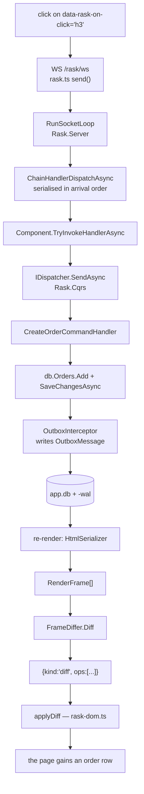
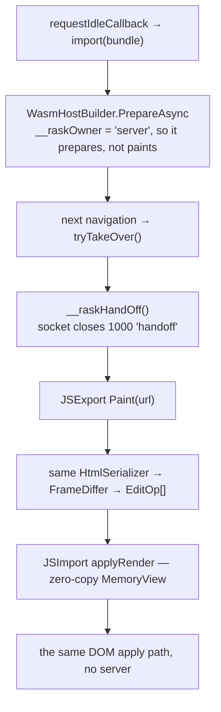
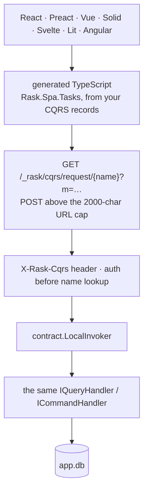
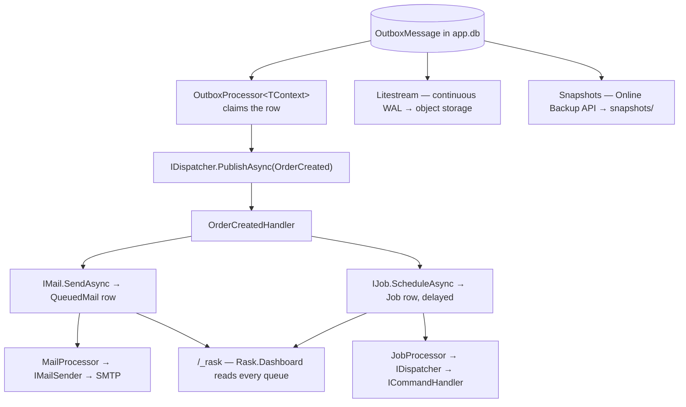

# Data flow: from a click to SQLite and back

How every part of Rask connects, from the UI down to the database. The map below is the whole
architecture in one picture; the sections after it walk the five journeys across it, naming the real
types so the diagram and the code agree.

For the render walk in detail — the frame stream, the edit-op codec, keyed reconciliation — see
[Live rendering & the diff codec](live-rendering.md). This page is the layer above: what the pieces are
and how a request crosses them.

> The picture is generated, not drawn. It is a Rask component
> ([`FlowAnimation`](../../samples/Rask.Example.Site/FlowAnimation.cs)) baked to
> `assets/rask-flow.svg` and pinned byte-for-byte by a test, so it cannot drift from the repository it
> describes. Two of those tests are the point: one walks `src/` and fails when a package has no box on
> the map, the other pins the SPA chips to the template list `rask new` advertises.

## Three things the picture is careful about

**There are two render engines, not five.** `RenderEngine.Server` and `RenderEngine.Wasm`
(`src/Rask.Core/RenderHost.cs`) are the same component model over two transports: one render walk
produces both HTML and a parallel `RenderFrame` stream, `FrameDiffer` turns two of those into
`EditOp[]`, and only the delivery differs.

**Islands are not a third engine, and they come in two kinds.** A React, Preact, Lit, Vue or Svelte
island brings its own renderer, so the subtree is `OpaqueSubtree` and the differ refuses to descend. A
Blazor island is the opposite: Rask renders it to HTML itself, so nothing in the browser owns those
nodes and it is diffed like any other markup.

**The SPA lane is not a render mode at all.** `Rask.Spa.Hosting` references no other Rask package —
no `Component`, no live session, no diff. It is static hosting plus TypeScript generated from your CQRS
message records, talking to the same handlers over HTTP.

---

## 1. A click reaches SQLite and comes back as a diff

The default journey for a Server page. The handler id is baked into the HTML at render time, so the
click carries everything the server needs to find the delegate.

The outbox write is the part worth pausing on: `OutboxInterceptor` runs inside `SavingChanges`, so the
`OutboxMessage` row is committed **in the same transaction** as the order. There is no window in which
an order exists but its confirmation was never scheduled.

## 2. The same components move into the browser

The bundle is fetched once the page goes idle. Nothing moves until the next navigation, and a page that
reaches a database stays on the socket.

`RaskRenderModes` is a **ceiling**, not an instruction: a page can opt down from it with
`[RenderMode(RenderMode.Static)]`, never above it. What pushes a page *up* is automatic — six
`InteractivityReason` flags, raised by registering an event handler, an `EditContext`, an
`ElementRef`, a JS call during render, a quiescence timeout, or a declared `RenderMode.Interactive`.

## 3. Two kinds of island, opposite diff semantics

Both use the channel the page already has. Neither opens a connection of its own.

```mermaid
flowchart TD
    subgraph foreign["React · Preact · Lit · Vue · Svelte — the runtime owns the DOM"]
        fprop["prop {'$h':'id'}"] --> frevive["revive() → hostSend"]
        frevive --> fh["handler in C#"]
        fh --> fop["ONE attribute op"]
        fop --> fstop["FrameDiffer stops at data-rask-opaque"]
        fstop --> fupd["adapter.update — reconcile, never remount"]
    end
    subgraph blazor["Blazor — Rask renders it, so it is NOT opaque"]
        bclick["the hosted component's own @onclick"] --> bwrite["BlazorFrameWriter wrote data-rask-on-*"]
        bwrite --> bsame["the delegated listener already in the page"]
        bsame --> bparam["RenderRootComponentAsync — same instance, new ParameterView"]
        bparam --> bdiff["diffed like any other Rask markup"]
    end
```

The asymmetry is deliberate and documented in `BlazorHost`: `FrameDiffer` skips an opaque element's
children, so a statically rendered island marked opaque would render new HTML on the server and never
ship it — painting once and then silently freezing.

Their prop models differ for the same reason. A JS island serializes props to JSON, so a nullable prop
that is null still writes its key. A Blazor island passes **live CLR objects** through `ParameterView`,
where writing null would clobber the hosted component's own default — so a null prop omits its key
instead.

## 4. A TypeScript SPA reaches the same handler

Note which bands this never touches: no component, no session, no render core, no diff.

Auth is checked **before** the message name is judged, so an anonymous caller gets 401 either way and
cannot enumerate which messages exist.

## 5. The work that outlives the request

The response has already gone. This is what the outbox row from journey 1 turns into.

At-least-once delivery is why `OrderCreatedHandler` has to be safe to repeat, and why an order deleted
between the commit and the relay is a normal race rather than an error.

## Where the files are

| File | What it holds |
|---|---|
| `app.db` (+ `-wal`) | your tables, plus `OutboxMessage`, `Job`, `QueuedMail`, `CacheEntry` |
| `logs.db` | `Rask.Logging` alone — a separate file on purpose, because a log line written during a failing transaction would roll back with it. **Not** covered by `rask db backup` or Litestream |
| `snapshots/*.db` | point-in-time copies through SQLite's Online Backup API, never a file copy |
| object storage | the Litestream replica — what makes one box a safe place to keep your only copy |
| IndexedDB | `Rask.SQLite.Browser` snapshots, per browser. There is no browser-to-server database sync; browser-local data reaches the server as a CQRS message like anything else |
