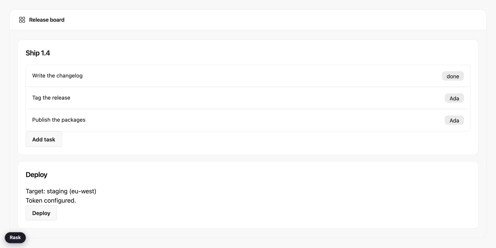
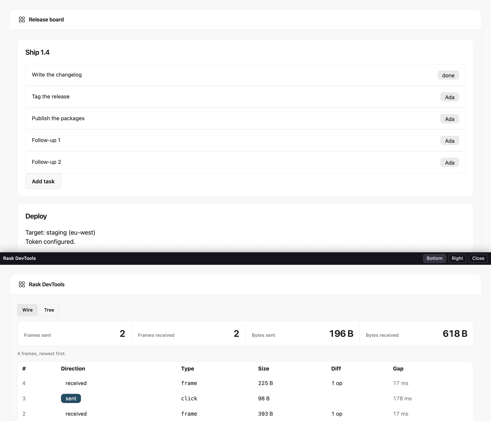
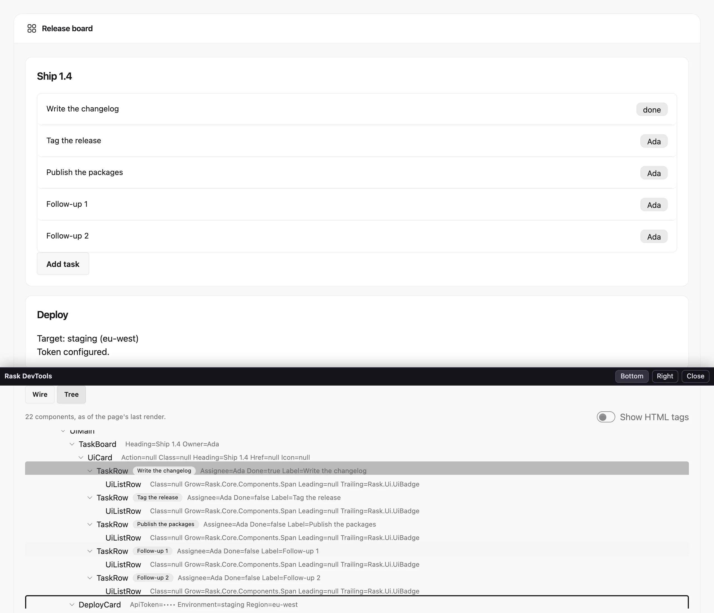
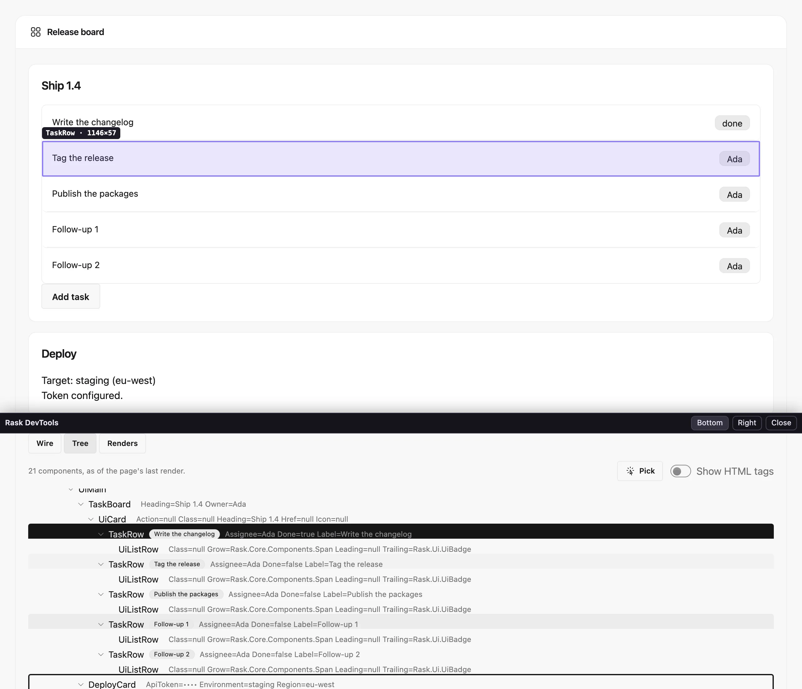
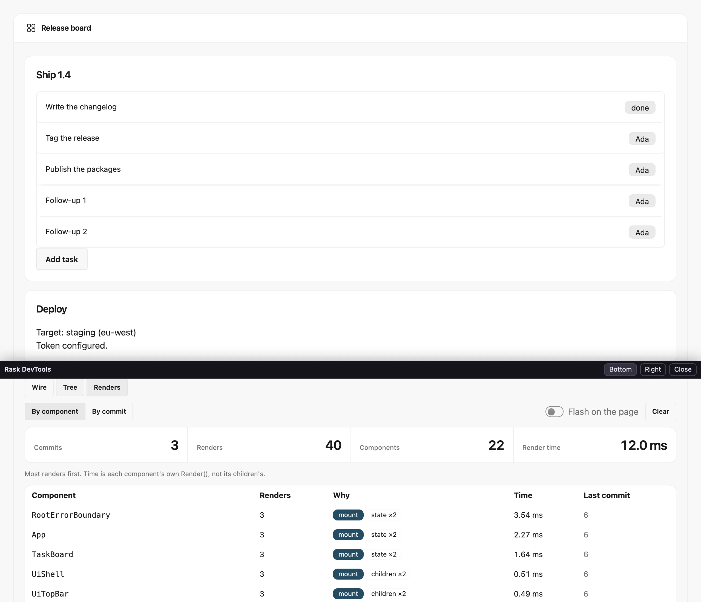
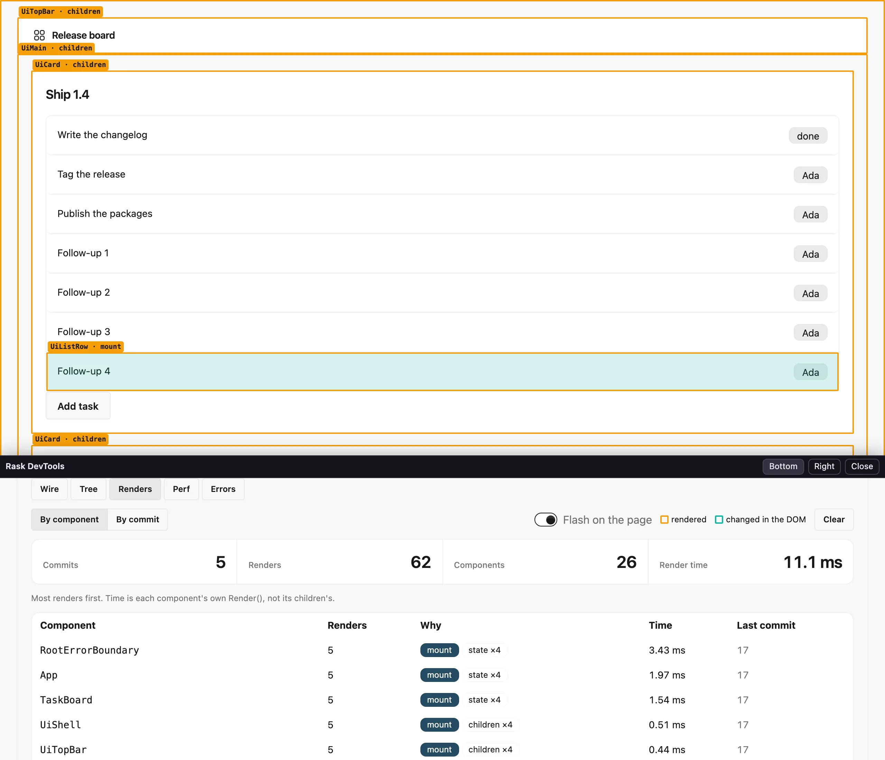
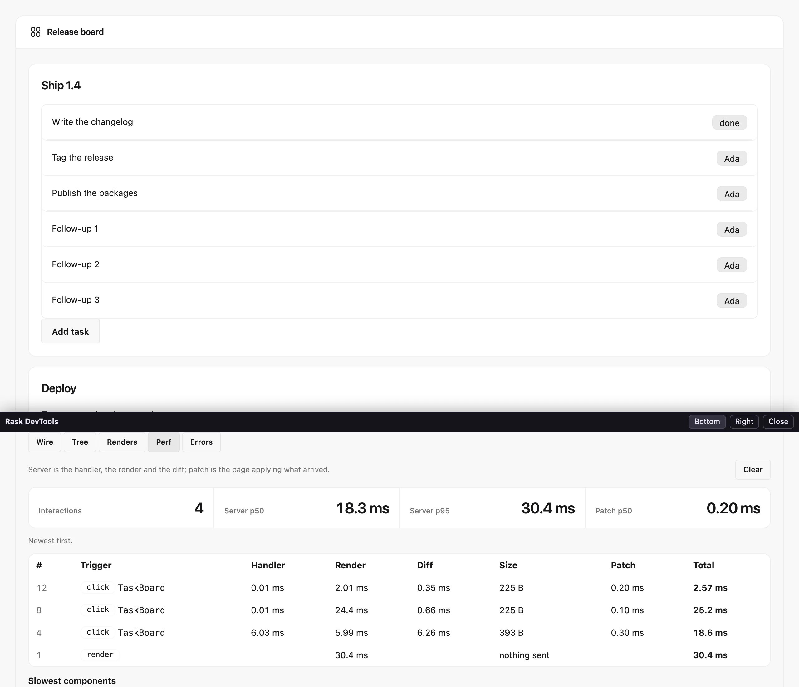
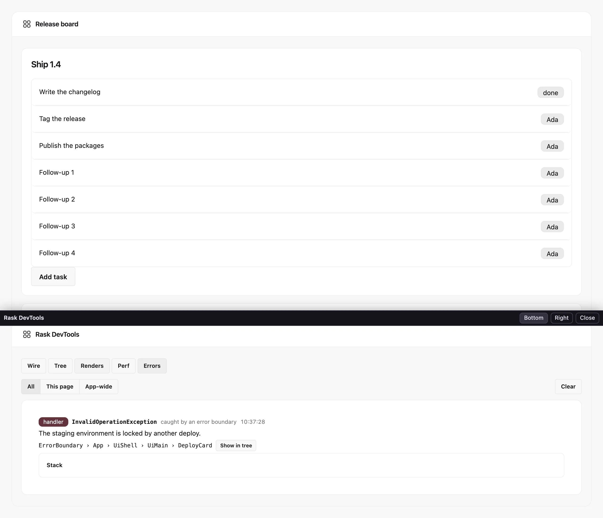
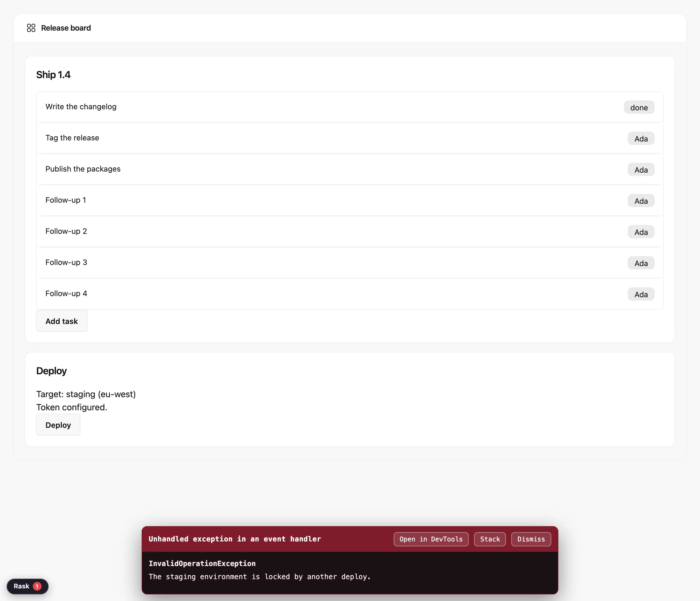

# DevTools: inspect the page you are building

Rask DevTools is a panel inside the page you are working on. It shows what the page and the app say to each other,
which components the page is made of and what each one was given, which of them render and why, where each
interaction's time goes, and what went wrong. It is there while you develop and gone from
what you ship.

<!--
  The pictures are taken of the real panel, not drawn: scripts/capture-devtools-screenshots.sh runs
  tests/Rask.DevTools.Showcase in Development, drives the pill and the panel in Chromium, and writes them to
  src/Rask.Site/wwwroot/img/devtools/. Re-run it whenever the panel changes.
-->



## Turning it on

An app made with `rask new` already has it. Run the app from a Debug build and the **Rask** pill is in the page's
bottom-left corner. Click it, or press **Ctrl+Shift+D** (**Cmd+Shift+D** on a Mac), and the panel opens.

An existing app adds the package. The panel is drawn with [the UI kit](ui-kit.md), so the app references that too:

```bash
dotnet add package Rask.DevTools
dotnet add package Rask.Ui
```

An app without the kit keeps running without the pill. On a Server host it logs a warning at startup naming the
package to add.

The panel appears only when all of these hold:

| Host   | When the panel is on                                                                          |
|--------|-----------------------------------------------------------------------------------------------|
| Server | A Debug build, the `Development` environment, and a browser on the same machine as the app.   |
| WASM   | A Debug build, and a page served from `localhost` or another loopback address.                |

A development server you reach from another machine refuses the panel. Set `RASK_DEVTOOLS_ALLOW_REMOTE=1` in the
app's environment to allow it. Each panel is also tied to the page that opened it, and to the signed-in user who
opened that page.

## Nothing of it ships

`RaskDevTools` is `true` in a Debug build and `false` in every other. When it is `false`, a publish leaves out the
devtools assembly, its scripts and its entry in the `.deps.json`. Then it checks the output, and **fails the
publish** if any of them is still there. Set the property yourself to decide otherwise, for example to turn the
devtools off in a Debug build:

```xml
<PropertyGroup>
  <RaskDevTools>false</RaskDevTools>
</PropertyGroup>
```

What a Release build of the framework keeps is a few hundred bytes of inert hooks in the page runtime. A size test
pins them.

## Docking

The panel opens as a drawer along the bottom of the window. **Right** docks it along the right edge instead, and the
page remembers the choice. **Close**, the shortcut, or the pill hides it again. Your place in the panel stays where you
left it.

## Wire

**Wire** lists every frame the page and the app exchange: each event the page sends, and each render frame the app
answers with. The totals sit on top: frames and bytes, each way.



Each row shows:

- **Direction**: *sent* for what the page sent, *received* for what came back.
- **Type**: the event the page sent, such as `click`, or `frame` for a render.
- **Size**: the frame's size on the wire.
- **Diff**: for a render, how many edits it made to the page. A frame that replaced the whole document has none.
- **Gap**: the time since the frame before it. A round trip, or a handler that renders more often than it needs to,
  shows up here.

The Wire tab records only the page's own traffic. The panel's own frames never show up in it.

## Tree

**Tree** shows the page's components nested the way they sit on the page. A card's rows sit under the card, even when
the page that uses the card is the one that built them. Each row shows what its component was given:



- **The type**, as you write it: `TaskRow`, `UiTree<Node, string>`.
- **The key**, as a badge, when the component has one.
- **Its props**, as `Name=value`. Rask writes the code that reads them when it builds the app, so they are there in a
  trimmed WASM app too.
- **What it is**, as a badge, when it is more than a component: an island's runtime (`React`, `Vue`, `Lit`…), or
  `Blazor`.

Select a row to see the component in full beside the tree: its key, every prop with its type and value, and its
[context](composition.md):

- **Provides**: each value its markup provides with `Context.Provide`, with its type, name and value.
- **Reads**: each value it read while rendering, through `Context.Get`, `Required` or `Has`, and where it came from.
  The provider is named by where the `Context.Provide` sits on the page, like the tree itself: the component it is
  inside. Click the name to select that component. **none in scope** means nothing above it provides that type and name.

Context is recorded while the panel is open. Open the panel on a page that has already rendered, and a component's
context appears with the page's next render.

An [island](islands.md) is a row like any other component, with the props your C# passed it. Its own components live
in the browser, so the tree ends at the island.

**Show HTML tags** adds the elements between the components, so you can see which `<ul>` a row sits in.

The tree is ready as soon as you open the tab, and it follows every render after that. Branches you open stay open
while the page re-renders.

### Finding a component on the page, and the page in the tree

Point at a row and the page shows where that component is: a box around everything it rendered, labelled with its
name and size.



**Pick** goes the other way. Press it, point at anything on the page, and the same box follows the pointer. Click, and
the tree opens to the component that rendered it and selects its row. The click goes to the devtools, not to your app.
Press **Esc**, or **Pick** again, to stop without choosing.

A pick lands on the nearest component. Some kit components, `UiButton` among them, render an element directly and
don't appear in the tree themselves, so pointing at a button picks the component the button sits in. With **Show
HTML tags** on, a pick lands on the element itself.

### Secrets stay out of it

A prop that looks sensitive is never read. It shows as `••••` instead. The decision is made when the app is built, so
the value never reaches the panel. A prop is treated as sensitive when:

- its name contains `password`, `passcode`, `secret`, `token`, `apikey` or `credential`, or is exactly `pin` or `ssn`;
- or it carries `[DataType(DataType.Password)]`, `[PasswordPropertyText]`, `[PersonalData]` or
  `[ProtectedPersonalData]`.

A provided context value follows the same words, matched against its name and its type's name:
`Context.Provide(key, Name: "api-token")` shows as `••••`. Its value is never formatted, so its `ToString` never runs.

Add one of those attributes to a prop whose name does not give it away.

## Renders

**Renders** counts the components whose `Render()` ran. A component that Rask served from its render cache did no
work, so it isn't counted. What's left is the list to read when a page feels slow: a component near the top that you
didn't expect to render on every click is the one to look at.



**By component** totals each component instance, most renders first:

- **Renders**: how many times its `Render()` ran.
- **Why**: each reason it rendered, with a count.
- **Time**: how long its own `Render()` took, added up. Its children aren't included; they render after it returns.
- **Last commit**: the number of the last commit it rendered in.

**By commit** lists the renders the page committed, newest first. Each row shows how many of the page's components
rendered, which ones, and why, with repeats folded together: `TaskRow ×3` rather than three rows.

A reason is one of these:

| Reason         | Why the component rendered                                                                   |
|----------------|----------------------------------------------------------------------------------------------|
| `mount`        | Its first render.                                                                            |
| `props`        | Its parent passed props that changed.                                                        |
| `state`        | `StateHasChanged`, or one of its own handlers ran.                                           |
| `bypass cache` | It overrides `BypassRenderCache`, so it renders whenever its parent does.                    |
| `context`      | It read context or the culture, so it renders whenever its parent does.                      |
| `children`     | It takes children, so it renders whenever its parent does.                                   |
| `uncached`     | Nothing marked it, and it had no cached render: it renders nothing, or its output was reused. |

The tab holds the last 200 commits, or 5,000 renders if that comes first, so its totals cover the page's recent
past. **Clear** starts them again from nothing.

### Flashing renders on the page

Turn on **Flash on the page** and the page shows each render as it happens, in two colours:

- **Amber** boxes a component that rendered, labelled with its name and why: `TaskRow · props`.
- **Teal** boxes a part of the page that the update actually changed.



The two differ exactly where it matters. An amber box with no teal inside it is a component that rendered and changed
nothing on the page: work you can often avoid.

Flashing keeps going while the drawer is closed, and the page remembers the switch. After a reload it flashes straight
away: the panel loads behind the closed drawer to report what rendered. Turn the switch off to stop.

Teal boxes appear as soon as the page updates. Amber boxes come from the panel, a moment later.

## Perf

**Perf** times each interaction from the event to the updated page. A click whose handler renders the page is one
row. So is a navigation. A render that nothing on the page asked for, such as a timer or a push, gets a row named
`render`.



Each row shows:

- **Trigger**: the page event and the component whose handler ran, such as `click TaskBoard`. A handler that threw
  says so.
- **Handler**: the handler's own time. A render it asks for while it awaits counts under Render, not here.
- **Render**: the render walks the interaction caused.
- **Diff**: working out what to send to the page.
- **Size**: the frames sent, on the wire. *Nothing sent* means the render changed nothing. It also marks the page's
  first render, which arrives as the HTML page rather than as a frame.
- **Patch**: how long the page took to apply the frames. The page measures this itself, so it appears a moment after
  the row. A frame the page applied before the panel was open has no patch time.
- **Total**: all of the above.

The totals on top are the median (p50) and 95th-percentile (p95) server time, and the median patch time.

**Slowest components** lists the components that spent the most time in their own `Render()`, with how often they
rendered, their average and their slowest render. It covers the same recent commits as the Renders tab.

The tab keeps the last 500 interactions. **Clear** forgets them.

## Errors

**Errors** lists what went wrong while you used the page, newest first:

- **A component that threw**: in its `Render()`, in an event handler, or in an async lifecycle hook such as
  `OnMountAsync`.
- **A warning or an error from the framework**, such as two list items sharing a key, or a JavaScript call that failed.
- **A script on the page that threw**, or a promise that was rejected with nothing to catch it.
- **An island that failed** to mount, update or unmount, or whose props it could not read.

What your code logs with `console.error` is not listed: logging a problem is not the same as failing.

A red count on the **Errors** tab and on the **Rask** pill says how many errors you haven't looked at yet. Warnings
are listed, but not counted. Nothing opens by itself.



Each error shows:

- **What kind it is**: `render`, `handler`, `lifecycle`, `page script`, `island`, or `warning` / `error` for the
  framework's own.
- **The exception type and message**. Rask unwraps the wrappers .NET adds around it, so you see the exception your
  code threw.
- **Where it happened**: the components it sat in, outermost first. For an island, that is the component the island
  sits in. **Show in tree** opens the Tree tab at that component and selects it.
- **Whether an error boundary caught it**, for a handler or a lifecycle hook.
- **Its stack**, behind **Stack**.

The same error again, straight after, counts up as `×2` rather than adding a row.

A script or an island that fails before you have opened the panel still counts on the pill. The page keeps the last 50
such failures and lists them as soon as the panel opens.

Most framework warnings happen while a page renders or handles an event, and those are listed for that page. One
reported anywhere else, such as at startup or from a background service, belongs to no page. It is listed as
**app-wide** in every panel. **This page** and **App-wide** narrow the list to one or the other.

### Reporting a bug in Rask

Most errors are the app's to fix. When an error's stack points at Rask instead, the row says *This looks like a bug in
Rask itself* and offers **Report framework bug**. The test is the innermost frame outside .NET's own libraries: if
that frame is Rask's, the button appears; if it is your code, it doesn't, even when Rask called your code. For a
script error on the page, the frame has to be in one of Rask's scripts.

**Report framework bug** opens a draft of the issue for you to read and edit first. It holds:

- the exception type, and where it happened (rendering, a handler, a page script…);
- the components it happened in, by type name;
- the host, and the Rask, .NET, operating system and browser versions;
- Rask's own stack frames by name, with every run of your code collapsed to `[app code]`.

It never includes the exception's message, props, data, or any file path. **Open the issue on GitHub** opens a new
issue on the Rask repository with the draft filled in. Nothing is sent until you submit it there.

### From the error overlay

When you run the app with hot reload (`rask dev` or `dotnet watch`), a handler that throws also shows Rask's error
overlay at the bottom of the page. With the devtools on, the overlay has an **Open in DevTools** button. It opens the
panel on the Errors tab.


